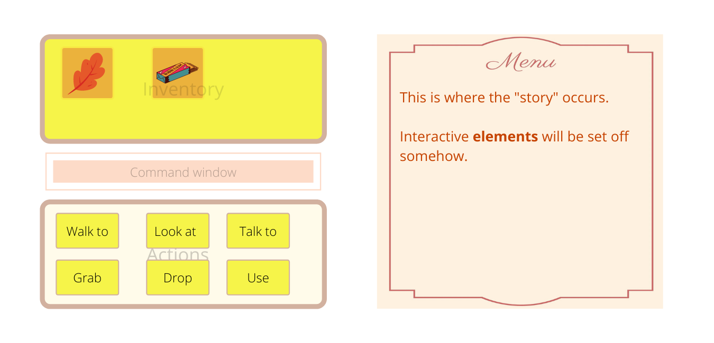

# Classy Dinner Adventure Game 2.0

[Version 1.0](https://github.com/lind1125/Classy-Dinner-Adventure-Game)

## Concept

Version 1.0 was a Unit 1 project for the General Assembly Software Engineering Intensive. It is a text-based point-and-click adventure game using vanilla JS DOM manipulation. Styling is very minimal.

For 2.0, I am refactoring the game into a React app, as well as updating the styling and design.

### Wireframe
---

